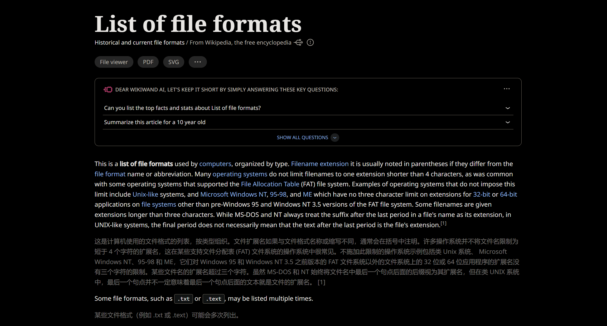
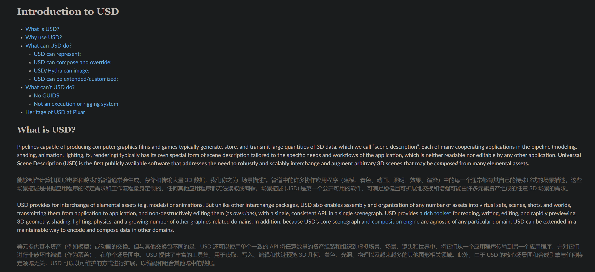
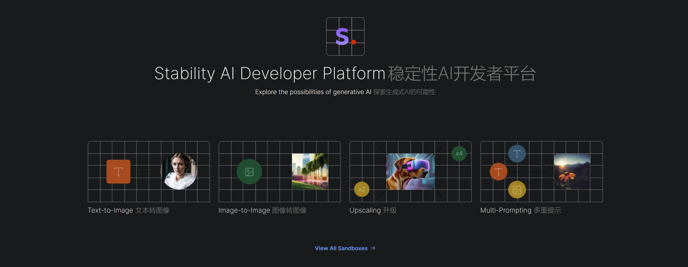
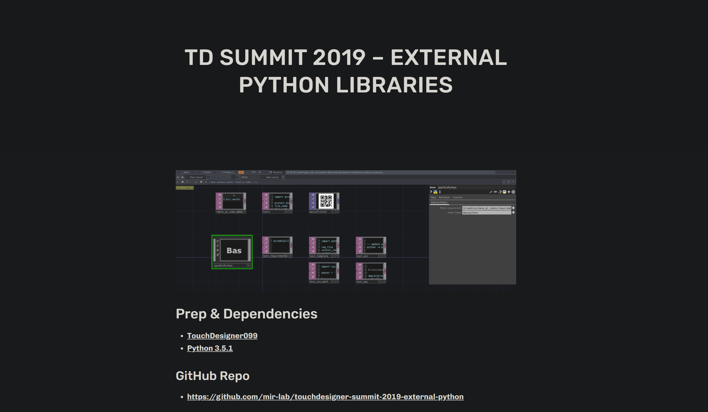
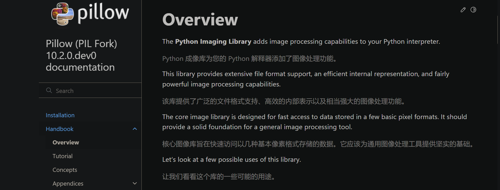
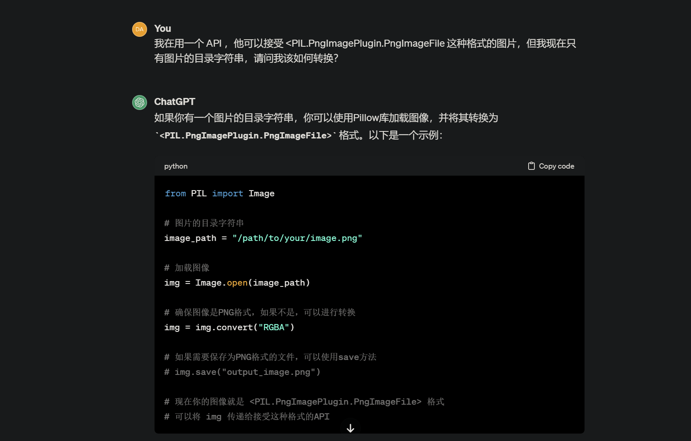
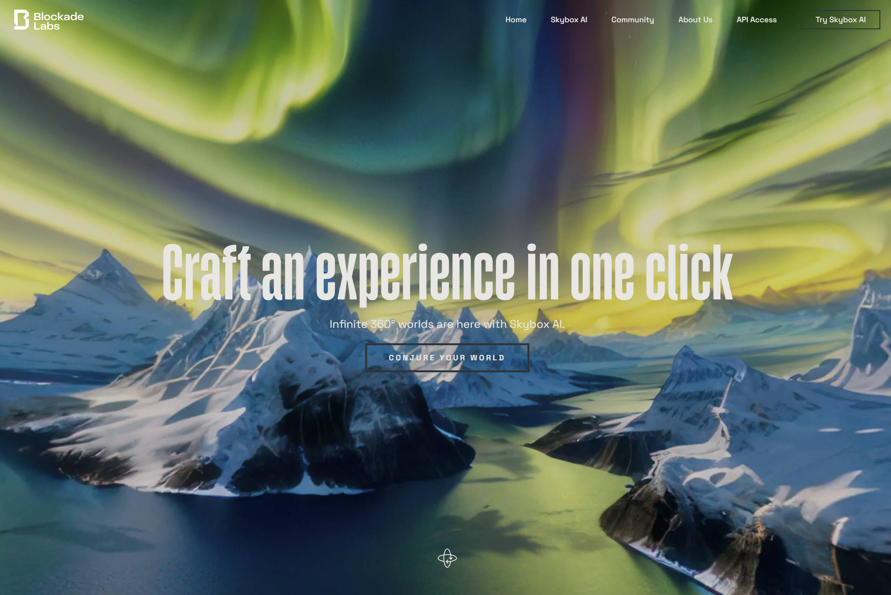
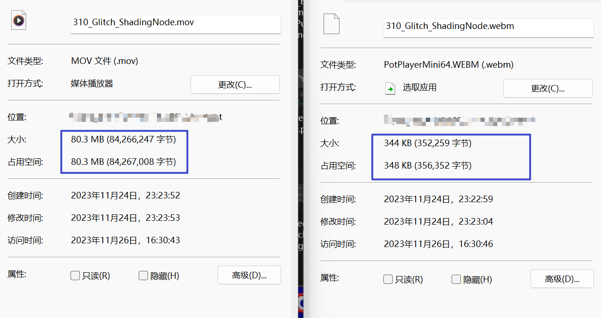

# 很大声周刊-vol.127
很大声周刊，在这里记录日常工作、生活所见，每周一发布。



# Houdini 输出点云文件 .ply 到 Touchdesigner


## 准备模型



## 输出点云文件 .ply


## 模型转点云 - VEX


``` C++
// keijiro
// https://gist.github.com/keijiro/4aa156ac21779dcdc85849062785db2f

int vlist[] = pointvertices(0, @ptnum);
vector uv = vertex(0, "uv", vlist[0]);

string path = "texture_file_path.jpg";
@Cd = colormap(path, uv);
```


方法来自 [mesh_to_pointcloud - keijiro ](https://gist.github.com/keijiro/4aa156ac21779dcdc85849062785db2f) 



## 输出点云文件 .ply


通过 [ROP Geometry Output](https://www.sidefx.com/docs/houdini/nodes/sop/rop_geometry.html) 输出 [.ply](https://www.wikiwand.com/en/PLY_(file_format)) 文件。

## 在 Touchdesigner 中读取 .ply

颜色信息


转换 RGB


# 小白兔白又白



# Beyond Beliefs - Ben Böhmer
