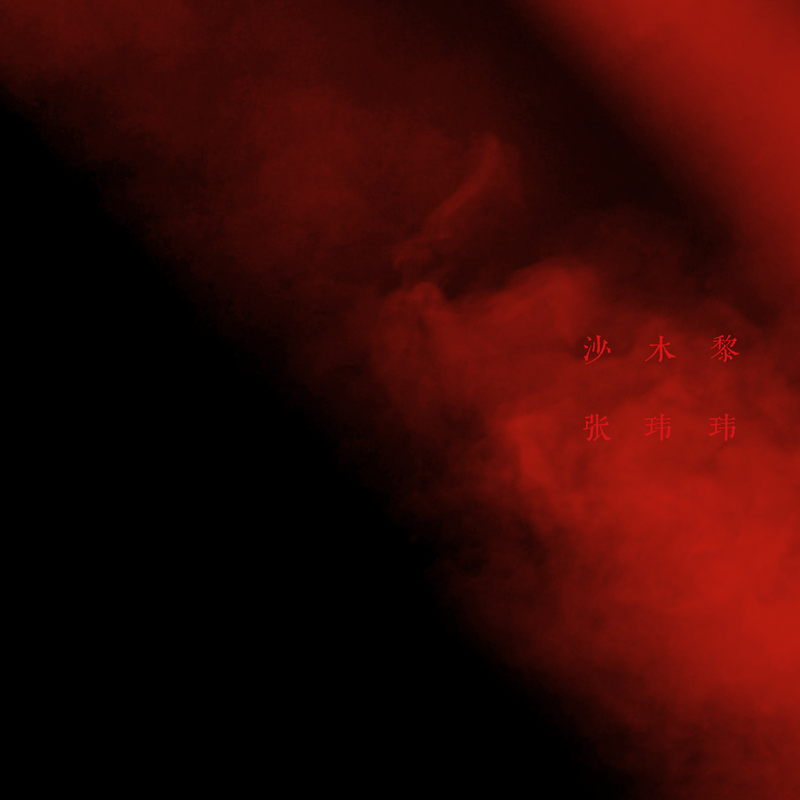

# 很大声周刊-vol.131
很大声周刊，在这里记录日常工作、生活所见，每周一发布。

# 在 Blender 中输出支持 ARKit 的 usdz 文件

[ARKit](https://developer.apple.com/cn/augmented-reality/) 是苹果家的 AR 处理方案，支持 [USDZ](https://openusd.org/release/spec_usdz.html) 格式文件。

这样的话常见的 fbx/obj/glb/... 需要经过转换格式才能在 AR 中使用。

在转换格式的过程中发现 [LightCraft](https://www.lightcraft.pro/) 在 Blender 3.5 基础上修改过的[版本](https://www.lightcraft.pro/downloads)，内置输出 USDZ 文件模块，并且对 ARKit 有很好的支持，目前可用的转换工具除了苹果自家的 [Reality Converter](https://developer.apple.com/augmented-reality/tools/#:~:text=objects%20on%20Mac.-,Download%20(70.7%20MB),-USDZ%20Tools)，就是这一版的 Blender 了，而且后者没有对硬件设备的依赖。

# 关于 USD 的支持可能会越来越多？了解一下准没错

[USD（通用场景描述）](https://openusd.org/release/intro.html)
> - USD 是一个高性能可扩展的协同构建动画 3D 场景的软件平台，旨在满足大规模电影和>视觉效果制作的需求。
> - USD 通过其扩展的模式集实现数字内容创建工具之间的稳健交换，涵盖几何、着色、照明和物理等领域。  
> - USD 独特的组合能力提供了丰富多样的方式将资产组合成更大的组件，支持协作工作流程，以便许多创作者可以轻松地一起工作等等。
>
>Pixar Animation Studios

# 小白兔白又白
 

# 永丰街 - 张玮玮
