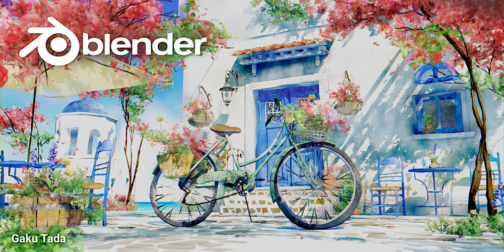

# 很大声周刊-vol.132

# 面向初学者的生成式 AI 课程 - 微软

微软推出的[《面向初学者的生成式 AI 课程》](https://microsoft.github.io/generative-ai-for-beginners/#/)

> 通过 Microsoft Cloud Advocates 提供的 12 课时综合课程，了解构建生成式 AI 应用程序的基础知识。每节课都涵盖生成式人工智能原理和应用程序开发的一个关键方面。在整个课程中，您将构建自己的生成式人工智能初创公司，以便了解如何实现您的想法。

# Stability\.ai -Stable Diffusion API

[stability\.ai ](https://platform.stability.ai/) - 提供 Stable Diffusion API 

# 在 Touchdesigner 中引入本地 Python 库

[TD SUMMIT 2019 – EXTERNAL PYTHON LIBRARIES](https://matthewragan.com/workshops/td-summit-2019-external-python-libraries/)

在 Touchdesigner 中引入本地 Python 库文件还挺复杂的，文章对 Python 版本并没做太多说明，在尝试过程中要特别留意这个问题，Touchdesigner Python 版本和本地 Python 版本需要保持一致。

# Blender 4.0 发布

[Blender 4.0 发布](https://www.blender.org/download/releases/4-0/)

# Houdini 和 Blender 的 UV 处理对比
.gif>)

Houdini 的处理方式更加整体，基本上所有属性都在 SOP（表面操作）模块中完成，材质中会自动获 UV 信息，而 Blender 需要在材质中完成这一操作。

两种处理方式和软件本身的工作逻辑直接相关，Houdini 的工作流程更复杂，在 SOP 模块中编辑 UV 信息意味着 UV 数据可以参与后面的操作中。而 Blender 则更加短平快，不需要考虑太多关联项。不同的处理方式也是面对不同需求时，选择软件/工具的考量依据。

# 小白兔白又白

# Nobody - Mitski
