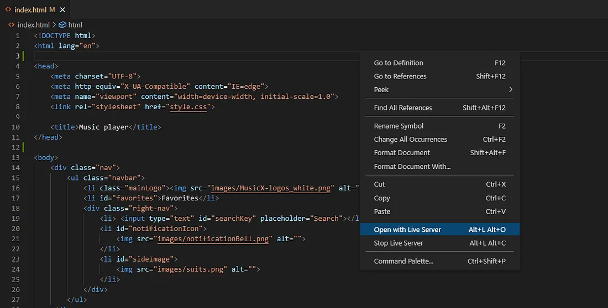

# 很大声周刊-vol.133

# 在移动端打开 VS Code Live Server 本地服务器

[Live Server](https://marketplace.visualstudio.com/items?itemName=ritwickdey.LiveServer) 是基于 VS Code 的一款插件，具有实时重载加载功能的本地服务器。有些情况下需要通过移动端测试，[在移动端打开 VS Code Live Server 本地服务器](https://medium.com/@pavankapoor31/how-to-use-vs-code-live-server-local-host-on-mobile-phone-8b38a62117d2) 这里有一份简单好用的说明。

# Python Pillow - 图像处理

> [Pillow（PIL Fork）](https://pillow.readthedocs.io/en/latest/handbook/overview.html)是 Python 编程语言中的一个图像处理库。它最初是Python Imaging Library（PIL）的一个分支，旨在提供对图像处理的强大支持。Pillow使得在Python中处理图像变得更加容易，并提供了许多功能，包括图像打开、保存、编辑、转换和处理等。

我尝试给 Stable Diffusion 写入参考图片时遇到 `must be real number, not str` 报错。

它只支持 `PIL.PngImagePlugin.PngImageFile` 这种格式的信息，这些我都没看太懂，从 ChatGTP 那里得知 [Pillow](https://pillow.readthedocs.io/en/latest/handbook/overview.html) 可以解决这个问题，原来报错信息里的 `PIL` 指的就是 [Pillow](https://pillow.readthedocs.io/en/latest/handbook/overview.html) 的缩写，引入时也会这样写 `from PIL import Image`。

# 带有 Alpha 通道的视频格式
.gif>)

带有 Alpha 通道的视频格式通常用于支持图像或视频的透明度。一些常见的视频格式，如 WebM 和 MOV（使用ProRes 4444编解码器），支持 Alpha 通道。

通过 [FFmpeg](https://ffmpeg.org/) 可以很简单的完成格式转换。

**序列帧到 webm alpha 视频**
`ffmpeg -framerate 30 -i %04d.png -c:v libvpx-vp9 -b:v 1M -c:a libvorbis -pix_fmt yuva420p output.webm
`

**序列帧到 mov alpha 视频**
`ffmpeg -framerate 30 -i %04d.png -c:v prores_ks -profile:v 4 -pix_fmt yuva444p10le output.mov
`

# WebM 视频格式
> [WebM](https://www.wikiwand.com/en/WebM) 是一种开放、免费的多媒体容器格式，主要用于在Web上播放视频和音频。它是一种开放标准，并由 WebM 项目维护。WebM 格式通常使用 VP8 或 VP9 视频编码和 Opus 音频编码，这些编码器都是免费且开放源代码的。

还有很重要的一点是 WebM 文件体积很小，前面同样序列帧输出的 .mov 和 .webm 两份文件体积差距特别大。

# 小白兔白又白

# 虎口脱险 - 周迅
