# 很大声周刊-vol.134

# Vercel - 超棒的前端部署工具
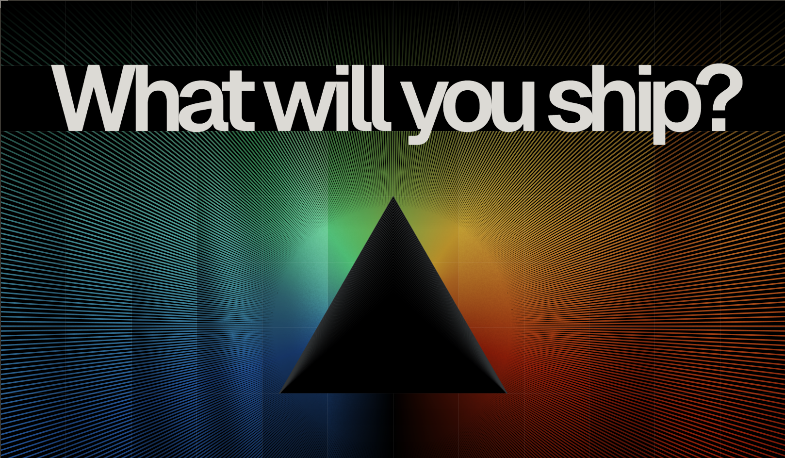

[Vercel](https://vercel.com/) 的前端云为开发人员提供构建、扩展和保护，更快、更个性化的 Web 体验和基础设施。

还没深度使用，但目前用到的功能体验超棒：
 - 支持从 Github 仓库直接导入并自动构建、部署；
 - 自动分配域名，支持 https;
 - 支持绑定域名；

# Skybox AI - 文本到 360°天空盒（AI）
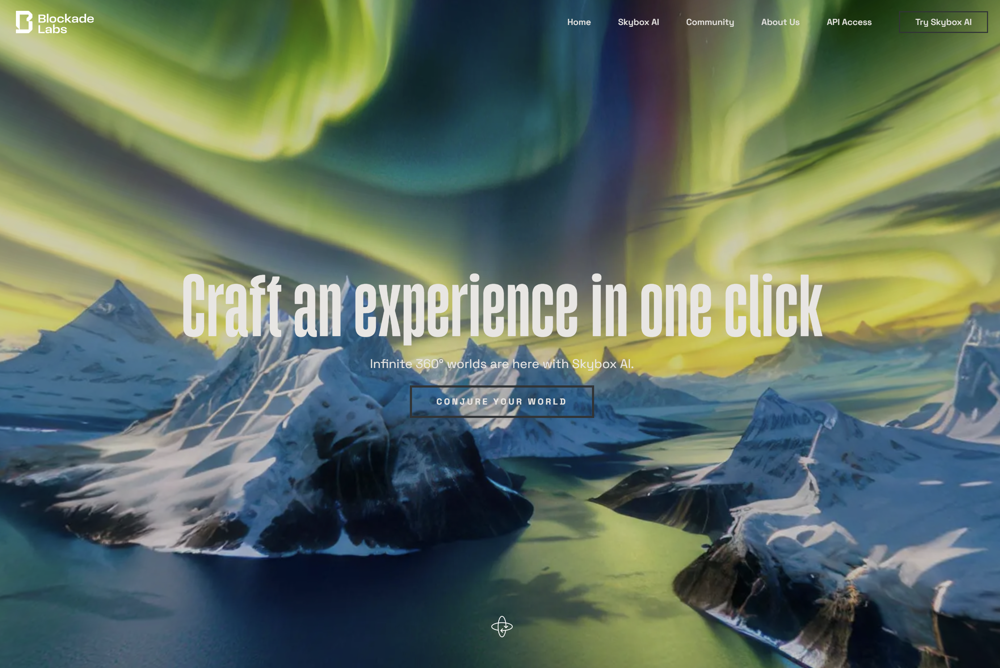

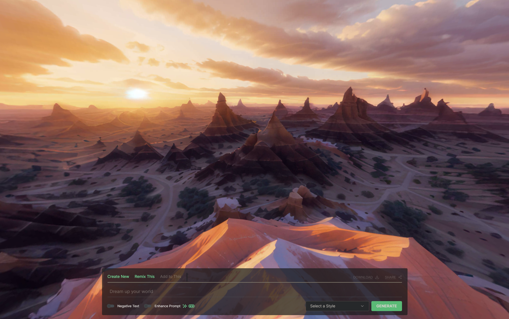

[Blockade Labs](https://www.blockadelabs.com/?_gl=1*1dj7q95*_ga*MjAwNDI1MDkzOC4xNzAxNDQyMDM0*_ga_YQXS5JLFDH*MTcwMTU4ODE2OS4zLjEuMTcwMTU4ODczNS42MC4wLjA.#about) 开发的 [Skybox AI](https://skybox.blockadelabs.com/?_gl=1*s69o6z*_ga*MjAwNDI1MDkzOC4xNzAxNDQyMDM0*_ga_YQXS5JLFDH*MTcwMTU4ODE2OS4zLjEuMTcwMTU4ODgxNi42MC4wLjA.) 工具可以实现文本到天空盒贴图的生成。

# glTF 模型示例
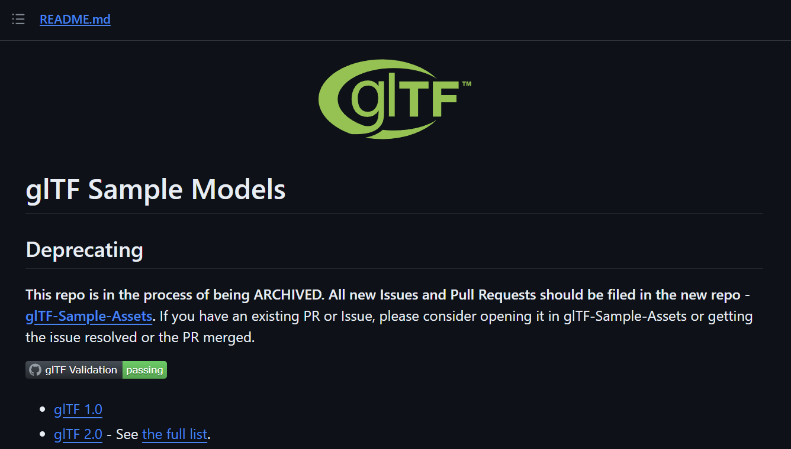
[glTF 模型示例](https://github.com/KhronosGroup/glTF-Sample-Models/tree/master)

# Squoosh - 开源图片压缩工具
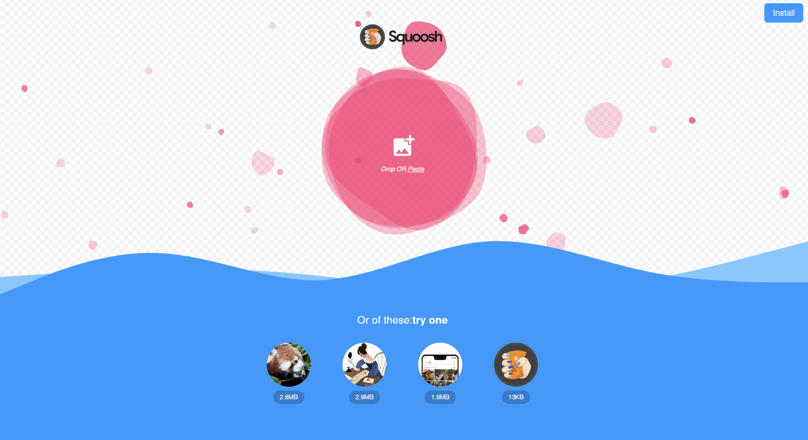

[Squoosh](https://squoosh.app/) 是谷歌 Chrome 实验室推出的开源 Web 图片压缩工具。

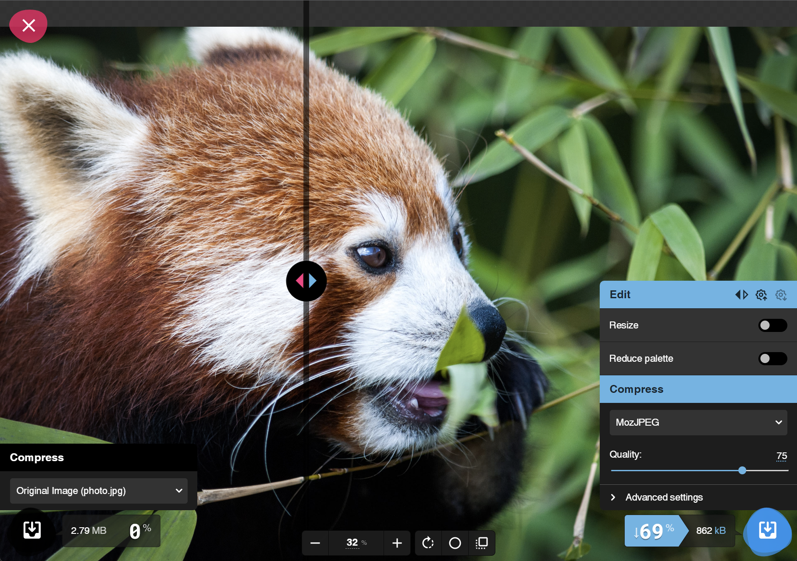
压缩后的尺寸和效果比多数同类工具好很多。

我想把它内置在网站中，所有图片资源先用它过一遍，这样网站压力会小很多。

# MatCaps Shadow - 材质捕获着色器
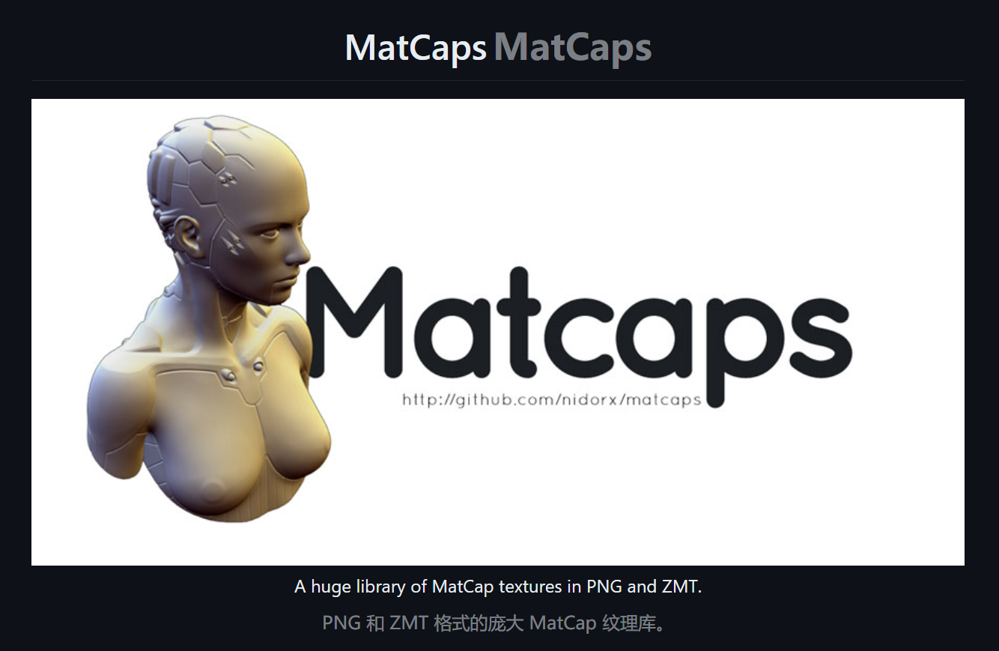

> MatCap（Material Capture，也称为 LitSphere）是完整的材质，包括光照和反射，因此您可以将其添加到对象中并不需要任何照明和反射。 MatCaps 允许您简单地通过绘制对象来创建表面材质和照明环境，使其看起来像您希望的表面效果。这为非真实图像渲染开辟了各种有趣的可能性。

[MatCaps Shadow - 材质捕获着色器](https://github.com/nidorx/matcaps)

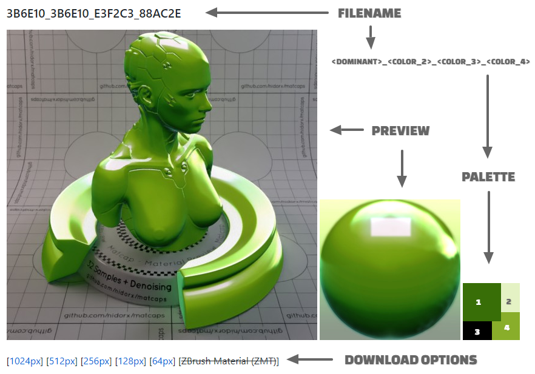

## MatCaps 应用
**Blender 材质快照**
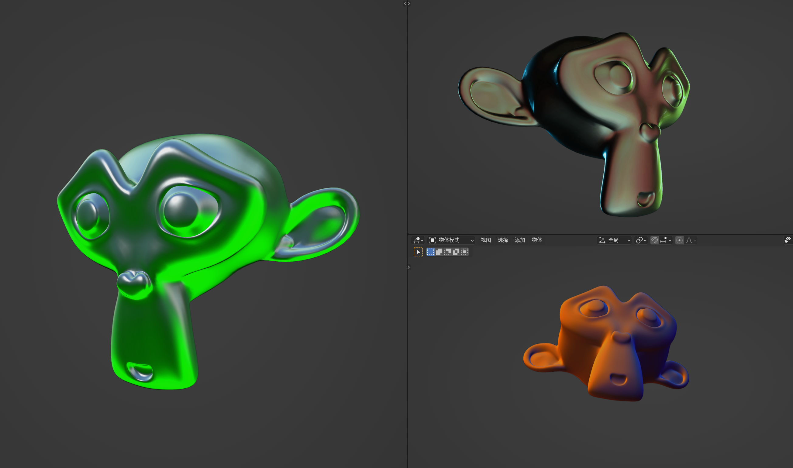

**[RedShift - MatCap](https://help.maxon.net/c4d/de-de/Subsystems/Default/Content/html/Texture+Matcap.html?TocPath=Shaders%7CTexture%20Shaders%7C_____7)**
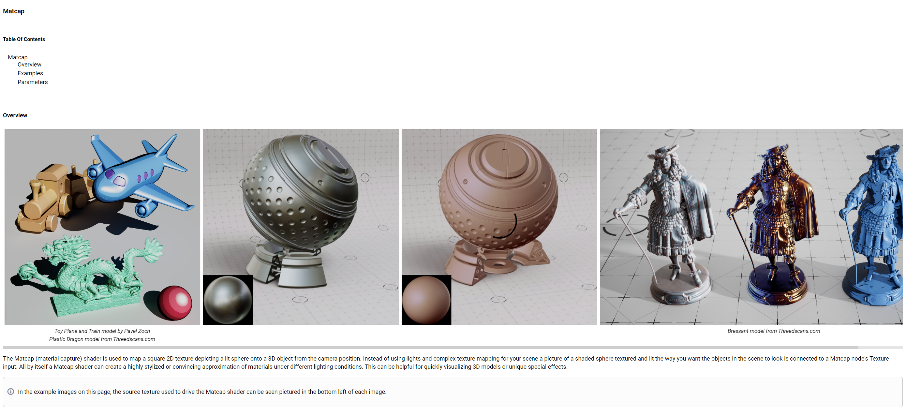

**[Houdini MatCap Shader](https://www.sidefx.com/docs/houdini/nodes/vop/matcapshader.html)**
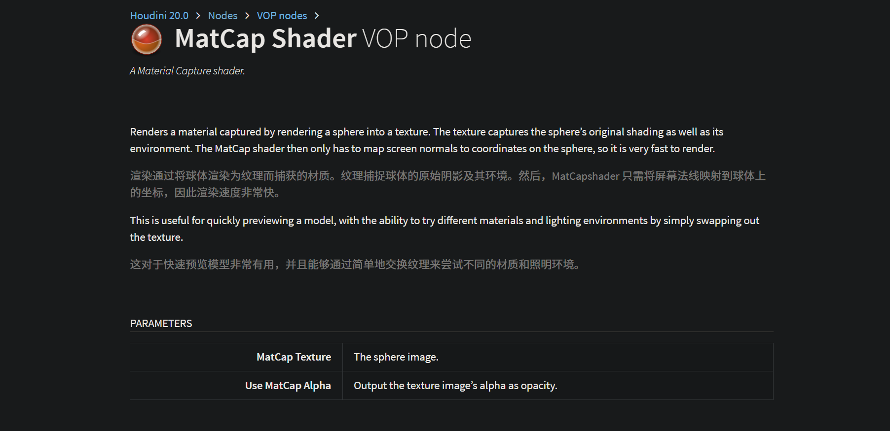

# Facetype.js
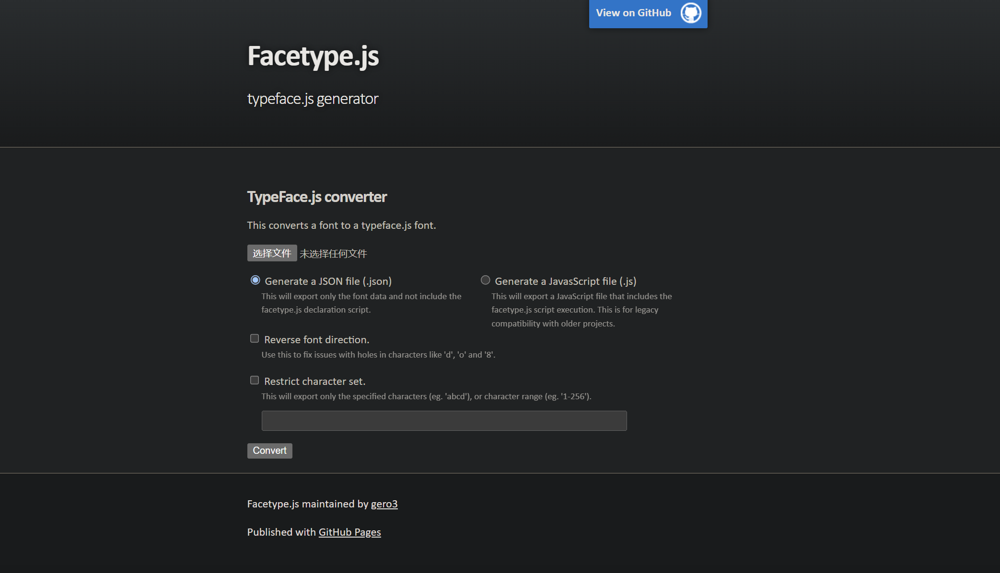

[Facetype.js](https://gero3.github.io/facetype.js/) 用于 [Three.js](https://threejs.org/) 字体格式转换。

# 文件格式列表
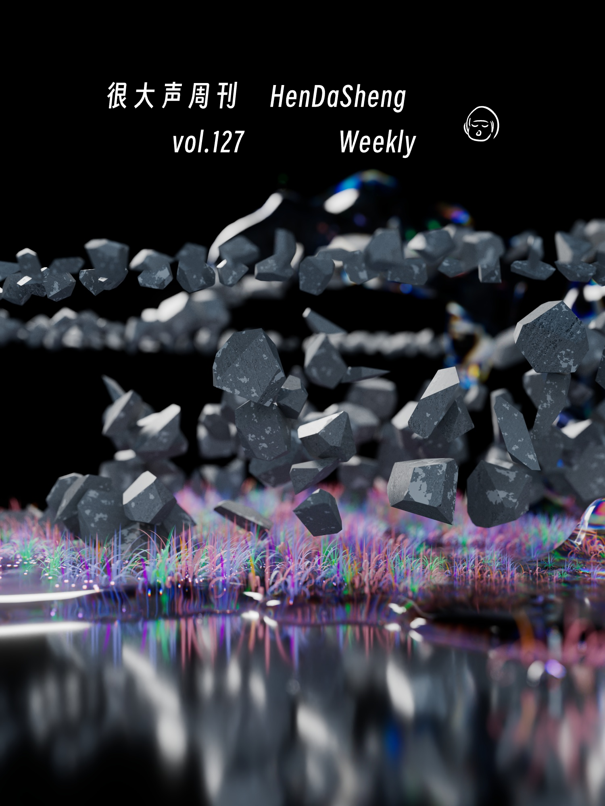

[文件格式列表](https://www.wikiwand.com/en/List_of_file_formats#3D_graphics)

# 小白兔白又白
  

# 金黄色的 - 郑宜农
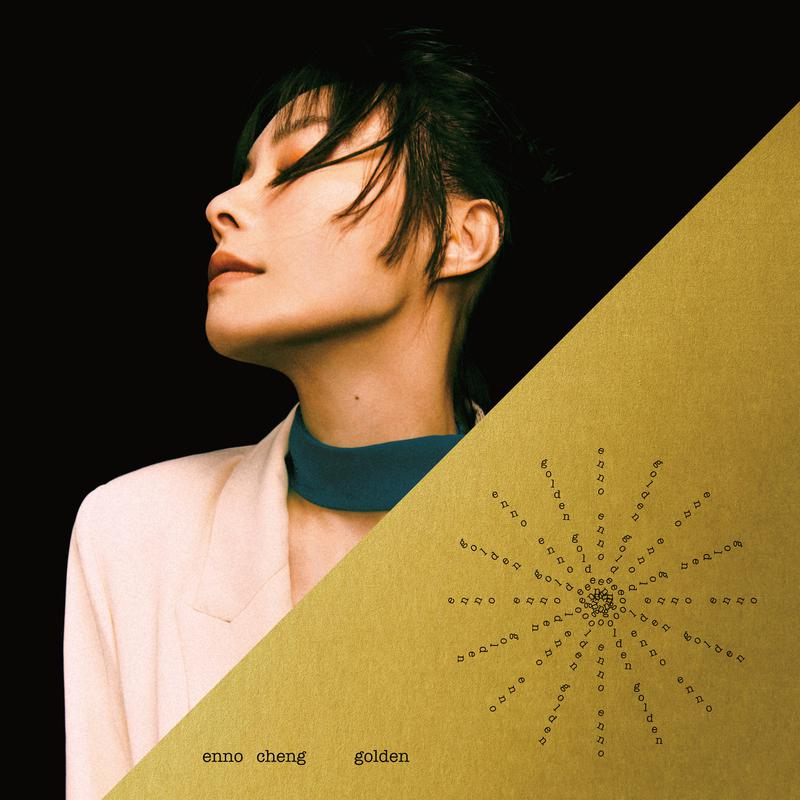