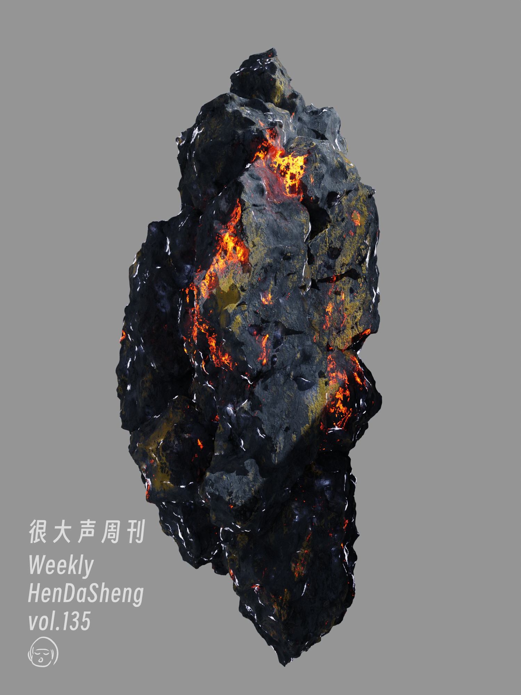

# 很大声周刊-vol.135

# Bard & Gemini - Google AI

[Bard](https://bard.google.com/) 是 Google 推出的对话式 AI
工具。

[Gemini](https://deepmind.google/technologies/gemini/#introduction) 是 Google 推出的 AI 模型，分为 Ultra、Pro、Nano 三个版本。

[在 Bard 中尝试 Gemini Pro](https://blog.google/products/bard/google-bard-try-gemini-ai/)

目前 Gemini Pro 已经集成到 Bard 中，明年年初将推出 Bard Advanced，用来访问最先进的 Gemini Ultra。

# Wappalyzer - 网页技术栈分析

[Wappalyzer](https://www.wappalyzer.com/?utm_source=popup&utm_medium=extension&utm_campaign=wappalyzer) 是一款分析网页技术栈的 Chrome 插件。

# WEB.DEV - 构建可在任何浏览器上运行的现代 Web 体验的指南

[WEB.DEV](https://web.dev/?hl=zh-cn) - 我们希望帮助您构建美观、易于访问、快速且安全的网站，从而能跨浏览器并为您的所有用户提供服务。本网站提供各种内容，由 Chrome 团队成员及外部专家撰写，可协助您顺利踏上这一旅程。

# Houdini 许可证问题

Houdini 的许可证安装、验证都很复杂，出问题的结果是软件无法打开，在项目中间出现这个问题就很酸爽了。

首先尽快在 [帮助文档](https://www.sidefx.com/faq/licensing-trouble/#faq401) 查看是否有合适的解决方案，没有的话尽快联系客户服务 support@sidefx.com，同时把诊断信息一并发送，有助于客服更准确地判断问题。

# gltf - 合并金属/粗糙度贴图

gltf 文件会自动将金属/粗糙度贴图合并为一张贴图，再通过通道区分，这种做法可以降低文件大小，在 web 端可以提高加载速度，渲染引擎方面可能减少对资源的请求，提高渲染性能。

这种做法在多数情况下是好的，但是在 usdz 格式中不好使，合并贴图后 usdz 无法准确识别相应贴图。

如果最终需要输出为 usdz，需要在输出前手动将贴图分离。

# 小白兔白又白
 

# Constellation - The fin
