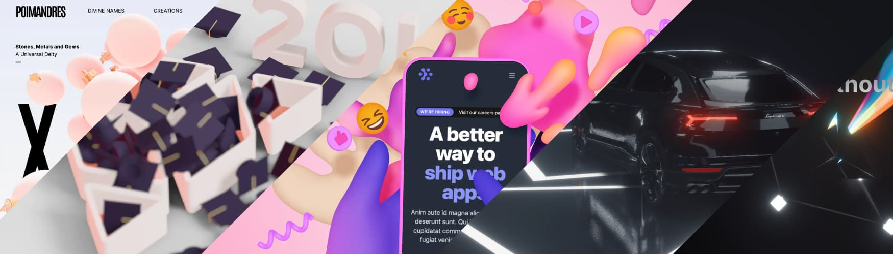
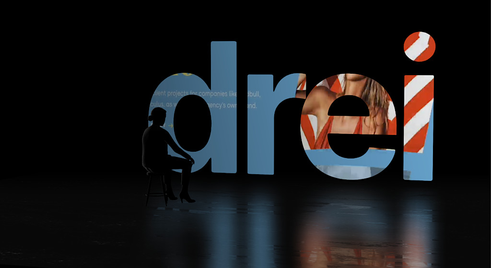
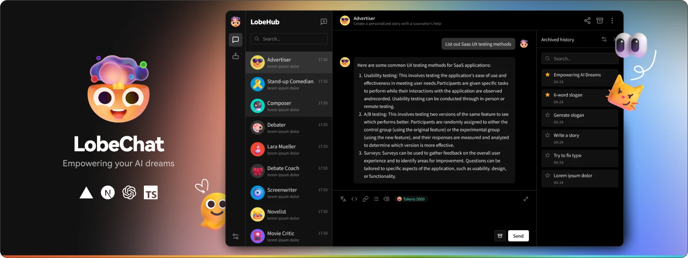
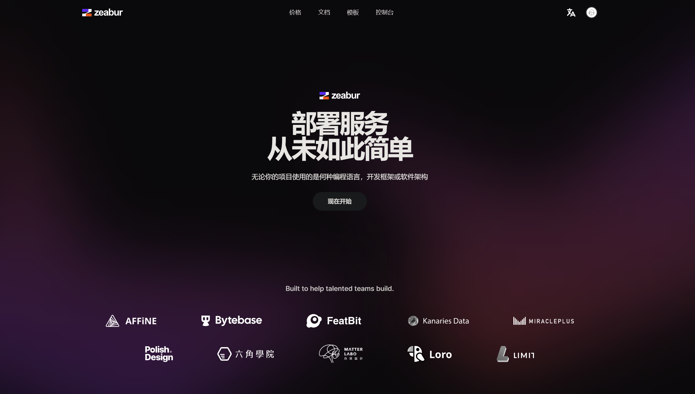

# 很大声周刊-vol.136


# React Three Fiber(R3F)

`@react-three/fiber`
[React Three Fiber](https://github.com/pmndrs/react-three-fiber) 用于 [ThreeJS](https://threejs.org/) 的 [React 渲染器](https://legacy.reactjs.org/docs/codebase-overview.html#renderers)

将 Three.js 的场景、相机、灯光等元素嵌入到 React 组件中变得更加简单。基于 WebGL，并通过 React 的声明性语法来创建和更新 Three.js 场景。

# drei - R3F 附加库

`@react-three/drei`

[drei](https://github.com/pmndrs/drei) 提供了一些额外的功能和组件，以简化使用 Three.js 进行常见任务的过程。它包含一系列已经实现好的组件，例如阴影、光照、模型加载等，让你可以更容易地在 React 中构建复杂的 Three.js 场景。

# npm install idealTree:lib: sill idealTree buildDeps 挂起
`npm install` 安装包时，因为网络原因大概率会出现这个问题，需要
```
rm `npm config get userconfig`
npm cache clean --force
npm config set registry https://registry.npmmirror.com
npm install
```
几个步骤重置 npm 配置、清空缓存，并使用 npm 镜像服务器，以解决问题。

[npm install idealTree:lib: sill idealTree buildDeps 卡着不动](https://www.jianshu.com/p/b1b934a05d6e)

# Lobe Chat - 开源聊天机器人框架


> 我们是一群充满热情的设计工程师，希望为 AIGC 提供现代化的设计组件和工具，并以开源的方式分享，以促进它们在更广泛的社区中的发展和采用，[LobeChat](https://github.com/lobehub/lobe-chat/blob/main/README.zh-CN.md) 目前正在积极开发中。

# Zeabur - 托管服务平台

[Zeabur](https://zeabur.com/zh-CN) 是一个可以帮助你部署服务的平台，无论你使用什么编程语言或开发框架，你都只需要通过几个简单的按钮进行部署。

对比传统的部署方式，Zeabur 可以让你在几分钟内完成部署，而不需要花费大量的时间去学习部署的相关知识，把时间精力专注于产品的开发。

# 小白兔白又白
 


# The Camera Loves You - Pardon Moi
