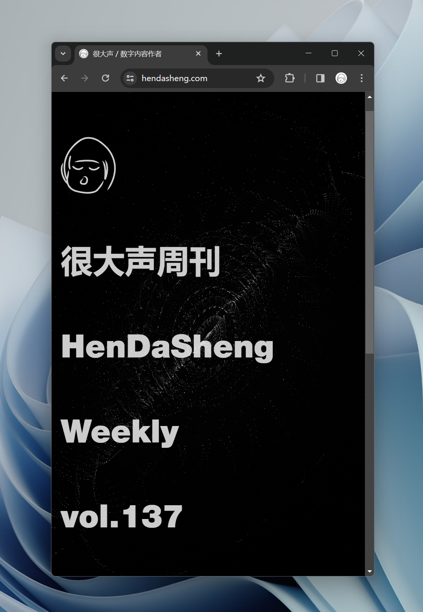
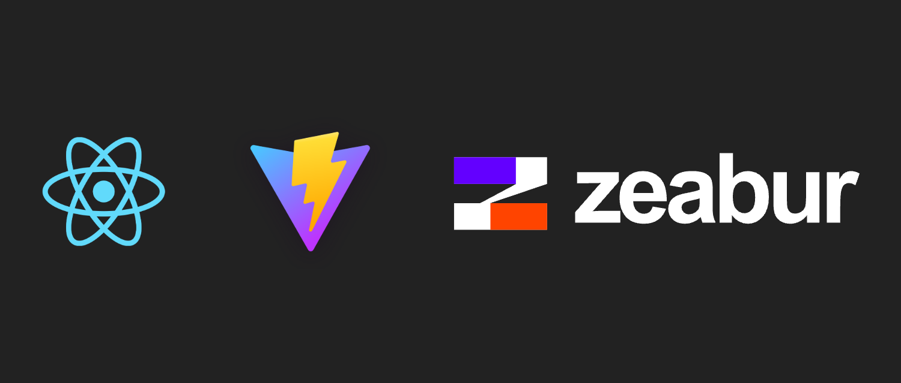
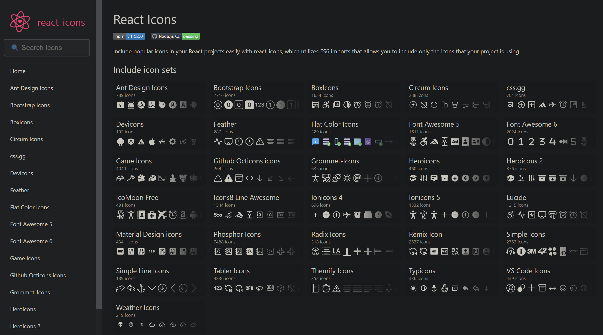
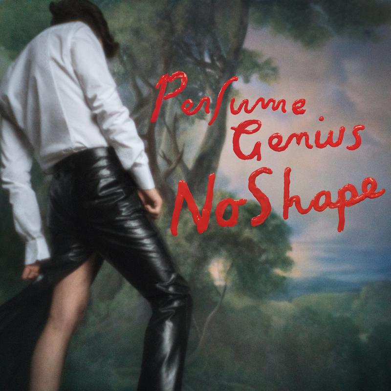

# 很大声周刊-vol.137

# React + Vite + Zeabur 搭建项目

[React](https://zh-hans.react.dev/) 适用于构建 Web 和原生交互界面的库；

[Vite](https://cn.vitejs.dev/) 是一种新型前端构建工具，能够显著提升前端开发体验。它主要由两部分组成：
- 一个开发服务器，它基于 原生 ES 模块 提供了 丰富的内建功能，如速度快到惊人的 模块热更新（HMR）;
一套构建指令，它使用 Rollup 打包你的代码，并且它是预配置的，可输出用于生产环境的高度优化过的静态资源。

[Zeabur](https://zeabur.com/zh-CN) 部署服务从未如此简单。无论你的项目使用的是何种编程语言，开发框架或软件架构
- Zeabur 可以自动地分析项目的代码，来判断项目使用的是什么编程语言或开发框架。
- 您只需支付实际使用的资源费用，而不需要支付整个EC2实例的费用。
- 在同一个地方部署所有所需的服务，可以降低管理成本，提高传输速度。

上面是它们对各自的介绍，虽然还没太弄明白，只有一些简单的认识，但已经在 ChatGTP、文档、教程 ... 的搀扶下尝试使用了。

[React](https://zh-hans.react.dev/)  在于通过组件构建用户界面，然后将各个组件整合成完整应用。

[Vite](https://cn.vitejs.dev/) 在于构建，没有这一步我们的应用只能跑在自己的电脑上（本地服务器），一个 Web 应用只能跑在本地服务器上是很尴尬的。Vite 可以帮更好地完整这部分工作。

[Zeabur](https://zeabur.com/zh-CN) 在于部署，部署大概意思就是把搭建好的应用投放互联网上，实现真正的“线上”应用。

# React Awesome Reveal
[React Awesome Reveal](https://github.com/morellodev/react-awesome-reveal?tab=readme-ov-file#features) 是一个用TypeScript编写的React应用库，它使用Intersection Observer API添加了Reveal动画来检测元素何时出现在视口中。动画由Emotion内部提供，并作为CSS动画实现，以受益于硬件加速。

🎁 现代技术栈 – 专为现代 React 构建，支持 React 18
🏷  TypeScript 支持 – 使用 TypeScript 编写，以提高开发体验
🍃 轻量级——项目占用空间很小
⚙️ 使用原生 API – 所有浏览器现在都支持 Intersection Observer 和 CSS 动画
🚀 快速 – 多亏使用原生异步 API 和硬件加速，实现了丝般顺滑的体验
💅 完全可定制 – 定义自定义动画，让库渲染它们
💻 SSR 支持 – 无需额外配置即可支持服务器端渲染
🌳 可按需引入 – 只有你使用的部分会包含在最终捆绑包中

# React Icons

使用 [react-icons](https://react-icons.github.io/react-icons/) 轻松在React项目中包含流行的图标，它利用 ES6 导入，允许您仅包含 的图标您的项目正在使用。

# 小白兔白又白
 

# Otherside - Perfume Genius
