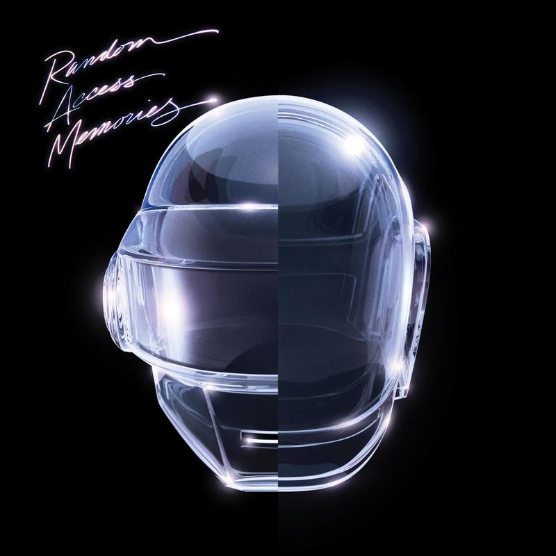

# 很大声周刊-vol.139

# Framer Motion - React 动画库

[Framer Motion](https://www.framer.com/motion/)
- 简单的声明性语法意味着您编写的代码更少。更少的代码意味着您的代码库更易于阅读和维护；
- 当在两个独立的组件之间制作动画时，Framer Motion 将处理之间的所有内容；
- Framer Motion 提供了更高级的侦听器，还扩展了 React 事件侦听器的基本集；

# Windows 字体访问权限问题
在应用中访问字体文件夹时可能会出现找不到已安装字体的问题，因为默认字体文件夹 `/user/window/Fonts` 需要访问权限，把字体文件放到外部文件夹中，在应用内访问这个外部文件夹即可找到所需字体文件。

# react-postprocessing

[@react-three/fiber](https://github.com/pmndrs/react-three-fiber) 的后处理模块，基于 [postprocessing](https://github.com/pmndrs/postprocessing)（three.js 后处理库），[在这里可以查看各个参数配置效果](https://pmndrs.github.io/postprocessing/public/demo/#antialiasing)。

# GLTF 文件压缩
线上应用对 3d 文件体积的要求非常敏感，除了对点线面的优化还有贴图方面的优化，[WebP](https://developers.google.com/speed/webp?hl=zh-cn) 格式非常适合这种需求。

通过 [Squoosh](https://squoosh.app/)、[FFmpeg](https://ffmpeg.org/) 都可以根据需求尽可能地压缩贴图。

# 小白兔白又白

# Infinity Repeating (2013 Demo) [feat. Julian Casablancas+The Voidz] - Daft Punk / Julian Casablancas / The Voidz
