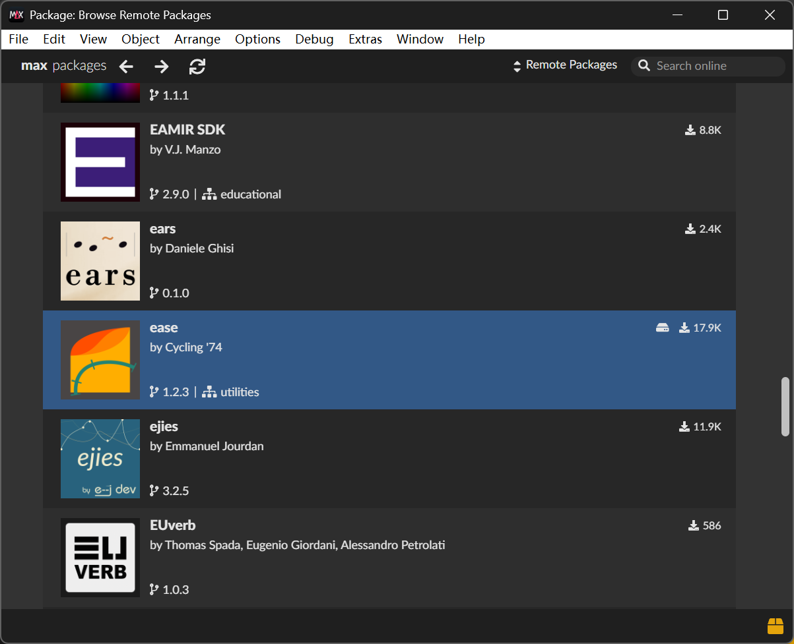
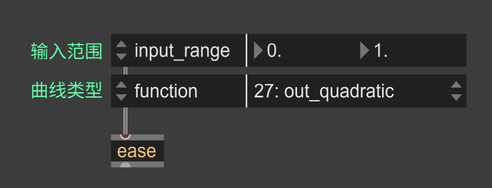
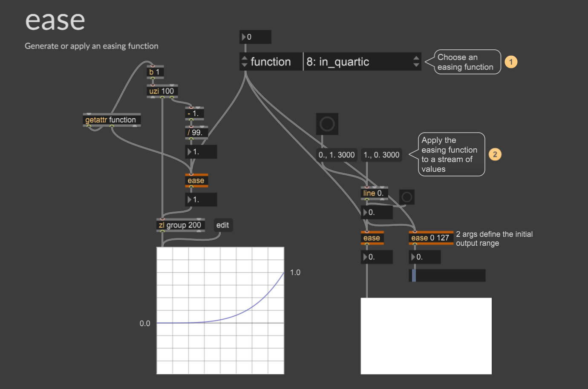
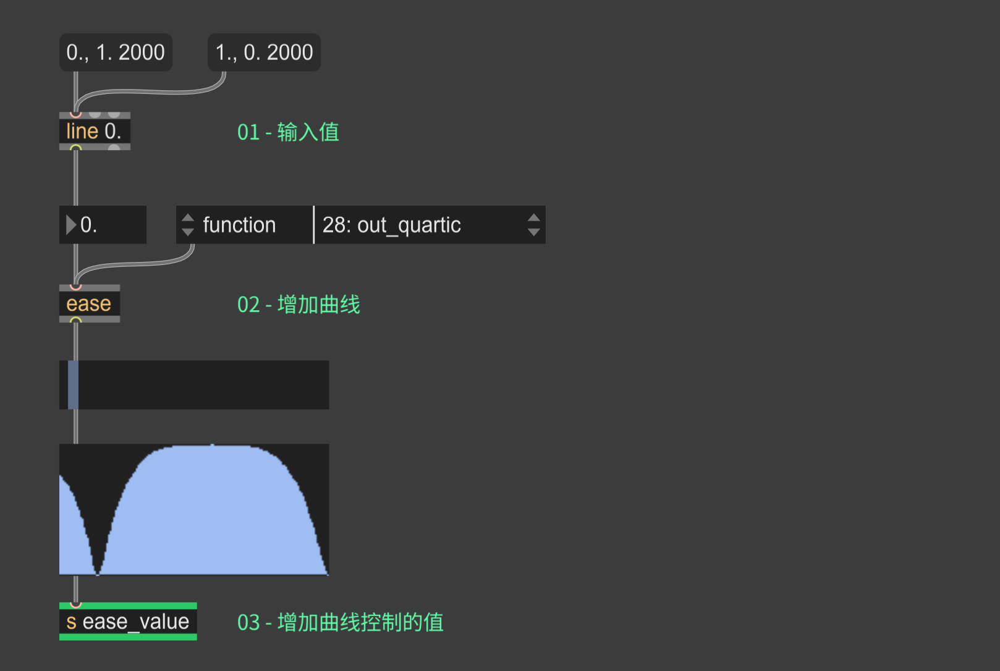

# 很大声周刊-vol.159 | 给 OSC 信号增加曲线控制 - MaxMsp

常规 OSC 信号是“布尔值、数值、字符串、数组”这样的指令性信号，我在最近的实时交互实验中大量用到 OSC，它可以根据逻辑设定收发，也能进行手动交互。它是一个高度通用的协议，多数场景下都可以使用，几乎可以用它控制一切。

不同工具对处理 OSC 信号的自由度不同，MaxMsp 是我用过自由度最好的（MaxMsp 不止是 OSC 工具，OSC 是它很小的一部分功能），原因在于它可以通过逻辑控制处理 OSC 信号，可以实现自动化控制，尤其是关联不同工具时，即便如此，在测试过程中还是遇到了问题。

OSC 信号虽然灵活可控，但是缺少动画关键帧那样的时间曲线。两者都是描述参数随时间的变化，最大的差异在于关键帧有曲线控制，而 OSC 信号是线性控制，相比之下 OSC 信号就显得生硬、突兀。

所以我一直在想怎么给 OSC 信号增加曲线控制，直到发现 [Ease](https://github.com/Cycling74/ease) ，它是 MaxMsp 官方维护的外部库，通过缓动函数处理数值，让 OSC 信号可以像关键帧那样通过曲线控制节奏。

## Ease (MaxMsp) 基础
01 - 打开包管理器，搜索并安装 Ease
这是由 Cycling ’74 官方维护的外部库，安装后你就可以在 Max 中直接调用各种缓动函数（easing functions）;

02 - ease 有多个输入项，其中 “输入范围 / 缓动函数（曲线类型）” 是两个核心输入，有这两项才能运行；

Ease 支持多种常见的缓动曲线，帮助页面有很清晰的可视化示意，可以更直观地查看曲线形态；

## 基本用法

`s ease_value` 为最终结果，后续可以通过 `r ease_value`接收这个值，并将它应用到任意需要曲线控制的参数上。

这种方式的想象空间很大——除了在 Max 内部使用，你也可以将这个值通过 OSC 发送到外部应用，实现跨软件的曲线控制。